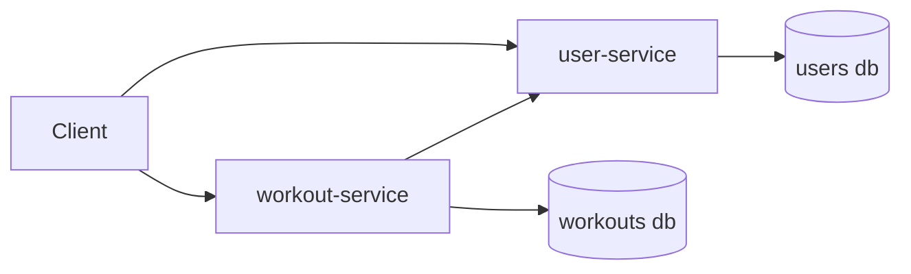
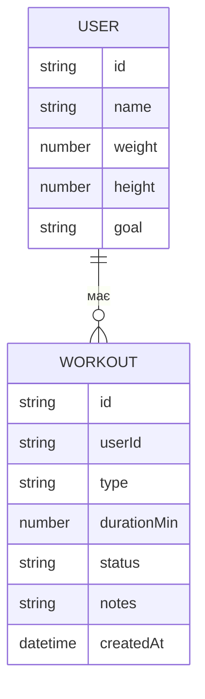

# GymTrack

**GymTrack** — навчальний сервіс для обліку тренувань користувача.

---

## Лабораторна робота №0 — Вибір ідеї

### Ідея

- **User Service** зберігає профіль користувача (параметри, базові дані).
- **Workout Service** створює та веде список тренувань, прив’язаних до користувача.

### Команда / Виконавець

- Виконавець: **MAV1k** (індивідуально)

### Репозиторій

- GitHub repo: (додай посилання)

---

## Архітектура

### Сервіси та роути (2×3)

**1) user-service**

- `POST /users` — створити користувача
- `GET /users/:id` — отримати профіль
- `PATCH /users/:id` — оновити профіль (вага/зріст/цілі)

**2) workout-service**

- `POST /workouts` — створити тренування (type, duration, userId)
- `GET /workouts?userId=...` — список тренувань користувача
- `PATCH /workouts/:id` — оновити/закрити тренування (notes, status)

### Компонентна взаємодія



---

## Модель даних (чернетка)



---

## Основні сценарії

1. **Створити профіль**: `POST /users`
2. **Додати тренування**: `POST /workouts` (workout-service перевіряє userId через user-service)
3. **Перегляд історії**: `GET /workouts?userId=...`

---

## Технології (план)

- Node.js + TypeScript
- Express (або NestJS)
- PostgreSQL + Prisma (ЛР4)
- Jest + Supertest, Playwright (E2E), Stryker (mutation)
- Prettier + ESLint
- Husky + lint-staged + commitlint (conventional commits)
- GitHub Actions CI + CD на staging

---

## Структура репозиторію (план)

```text
.
├─ apps/
│  ├─ user-service/
│  └─ workout-service/
├─ packages/
│  └─ shared/
├─ docker-compose.yml
└─ .github/workflows/ci.yml
```

---

## Запуск локально (план)

```bash
pnpm i
pnpm -r dev
```

---

## Тести (план)

- Unit (user): валідації оновлення профілю
- Unit (workout): правила статусів (open/closed)
- Integration: workout-service + users-service (HTTP) + БД
- E2E: “створити user → додати workout → отримати список”
- Mutation: Stryker репорт

---

## CI/CD (план)

- CI на PR: format/lint/build/tests/commitlint
- CD на main: автодеплой на staging, доступний URL

---

## План виконання лабораторних

- [ ] **ЛР0** Вибір ідеї, репозиторій, README
- [ ] **ЛР1 (08.10.2025)** Пакети, prettier, eslint, hooks
- [ ] **ЛР2 (22.10.2025)** Діаграми + ER + сценарії
- [ ] **ЛР3 (05.11.2025)** Прототип (статичні дані)
- [ ] **ЛР4 (19.11.2025)** БД інтеграція
- [ ] **ЛР5 (03.12.2025)** Повне тестування + mutation репорт
- [ ] **ЛР6 (17.12.2025)** CI/CD, staging, доступ з інтернету

---

## Прогрес / нотатки

- Дата:
- Зроблено:
- Далі:
- PR/посилання:
