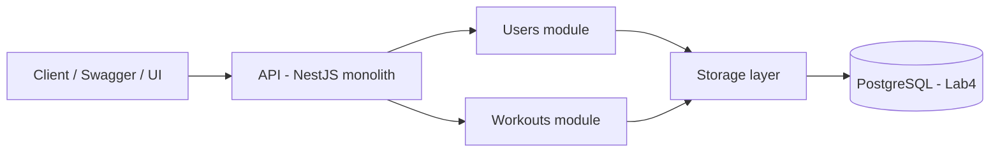

# Лабораторна робота №2 — Розробка структури застосунку (GymTrack)

## 1. Опис загальної структури

GymTrack реалізується як **монолітний веб-застосунок** на NestJS. Всередині проєкт поділяється на логічні модулі, кожен з яких інкапсулює власну бізнес-логіку та API. Такий підхід спрощує розробку і тестування (один деплой), але зберігає модульність.

## 2. Основні компоненти/модулі

### 2.1 API (HTTP Layer)

- Приймає HTTP-запити від клієнта
- Виконує валідацію вхідних даних (DTO + ValidationPipe)
- Делегує роботу відповідному модулю

### 2.2 Users module

Відповідає за:

- створення профілю користувача
- читання профілю
- оновлення параметрів профілю (вага/зріст/ціль)

### 2.3 Workouts module

Відповідає за:

- створення тренування
- перегляд списку тренувань (фільтр за userId)
- оновлення тренування (статус, нотатки)

### 2.4 Storage layer (шар зберігання даних)

- **ЛР3:** in-memory (масиви в сервісах або простий repository-клас)
- **ЛР4:** PostgreSQL + Prisma (заміна in-memory на реальні запити)

## 3. Взаємодія модулів (діаграма компонентів)

> Важливо: у Mermaid краще уникати кирилиці всередині `[]`, тому підписи англійською.

## 4. Межі відповідальності та залежності

- Controllers: тільки прийом запиту та формування відповіді
- Services: бізнес-логіка (правила зміни статусів, перевірки, агрегування)
- Storage/Repository: доступ до даних (in-memory або Prisma)

## 5. Розширення в майбутніх лабораторних

- ЛР3: реалізація основних сценаріїв на статичних даних
- ЛР4: підключення БД та міграції
- ЛР5: unit/integration/e2e + mutation testing
- ЛР6: CI/CD (GitHub Actions + деплой)
