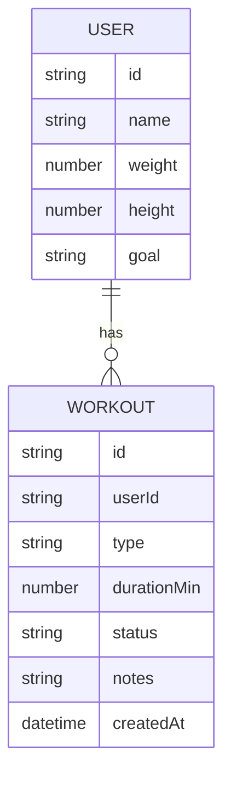

# Лабораторна робота №2 — Опис даних та зв’язків (ER)

## 1. Сутності

### 1.1 User

Призначення: профіль користувача, який володіє тренуваннями.

Основні поля:

- `id` — унікальний ідентифікатор
- `name` — ім’я користувача
- `weight` — вага (опціонально)
- `height` — зріст (опціонально)
- `goal` — ціль (опціонально)

### 1.2 Workout

Призначення: запис одного тренування, що належить користувачу.

Основні поля:

- `id` — унікальний ідентифікатор
- `userId` — посилання на користувача (FK)
- `type` — тип тренування (наприклад: cardio/strength/stretching)
- `durationMin` — тривалість у хвилинах
- `status` — стан (`ACTIVE` / `DONE`)
- `notes` — нотатки (опціонально)
- `createdAt` — дата створення

## 2. Зв’язки

- Один **User** може мати багато **Workout**
- Кожен **Workout** належить рівно одному **User**

## 3. ER-діаграма (Mermaid)

## 4. Обмеження/правила (для реалізації)

- `durationMin > 0`
- `status` приймає лише дозволені значення
- `userId` має існувати (у ЛР3 перевірка в in-memory, у ЛР4 — FK у БД)
